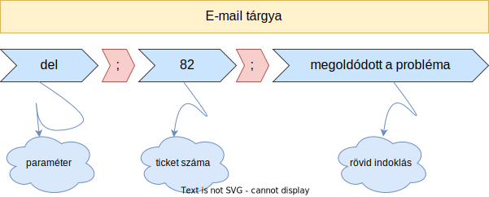

# 1. Airmax Ticket Rendszer

A rendszer a CW-al kapcsolatos problémák, fejlesztések, jogosultság igények, illetve tréningek hatékony jelzésére szolgáló rendszer.

A rendszerben rögzített ticketeket egy CW dev user magához rendeli, aki innentől kezdve a ticket felelőse.

# 2. A rendszer használata

A rendszer jelenleg egy megfelelő formátumú e-mail küldése esetén rögzíti a ticketet, a küldés sikerességéről, vagy sikertelenségéről a felhasználót e-mailben tájékoztatja.

# 2. Ticket típusok, illetve a ticketek létrehozásához szükséges e-mail formai követelményei

A ticket requestet minden esebten a `dev@airmaxcargo.com` e-mail címre kell küldeni, az e-mail törzse (body) szabadon szerkeszthető, a tárgy (subject) formátuma kötött, tickettípusonként minimálisan változó.

A tárgyban használt paramétereket a ticket típusától függően pontosvesszővel `;` kell elválasztani.

A felhasználónak törekedni kell arra, hogy az e-mailben küldött, csatolt és beágyazott (pl. aláírásban található) képeket a minimalizálja.

Érvényes paraméternek számít a kisebtűs (lowercase) vagy nagybetűs (uppercase), de akár a kettő kombinációjával deklarált paraméter is. A felesleges üres karaktereket (whitespace) az automatizmus törli. Kivételt képeznek ezalól azon paraméterek, amelyeket az automatizmus nem tekint változónak (pl.: ticket címe, üzenet törzse)

## 2.1 Issue

Minden olyan problémára `issue` típusú ticketet kell nyitni, amely:
- a felhasználó legjobb tudása szerint eddig működött a CW-ban, jelenleg pedig nem, részlegesen, vagy egyáltalán nem működik.
- edigg nem használtuk a CW-ben, valószínűleg működnie kellene de mégsem működik

### 2.1.1 Az Issue ticket felépítése

### 2.1.2 Példa Issue ticketre

állapot|ticket típusa|prioritás|ticket címe|példa tárgy
-|-|-|-|-
`new`|`issue`|`2` (1-5-ig terjedő skálán)|`nem tudom menteni a SAE24020436 számú shipmentet`| `new;issue;2;nem tudom menteni a SAE24020436 számú shipmentet`

## 2.2 Development

Minden olyan fejlesztésre `development` típusú ticketet kell nyitni, amely:
- CW-al kapcsolatos (pl.: workflow template beállítás, különböző registry beállítások módosítása, service taskok beálíltása,  stb.)
- CW-ból származó input/output műveletekkel kapcsolatos kapcsolatos

Development ticketet csak az erre jogosult személyek tudnak nyitni.

### 2.2.1 Az Development ticket felépítése

### 2.2.2 Példa Development ticketre

állapot|ticket típusa|prioritás|ticket címe|példa tárgy
-|-|-|-|-
`new`|`dev`|`2` (1-5-ig terjedő skálán)|`AVI shipmentnél előre definiált task list megjelenítése`| `new;dev;2;AVI shipmentnél előre definiált task list megjelenítése`

## 2.3 Role Request

Minden jogosultsággal kapcsolatos problémára `role request` típusú ticketet kell nyitni, 
- amely a felhasználó egy adott CW jogosultságának beállítására irányul.
- amely a felhasználói csoport egy adott CW jogosultságának beállítására irányul.

### 2.3.1 A Role Request ticket felépítése

### 2.3.2 Példa Role Request típusú ticketre

állapot|ticket típusa|rendszer|ticket címe|példa tárgy
-|-|-|-|-
`new`|`role`|`test` (rendszertől függően `test` vagy `prod`)|`Maintain -> Sales & Marketing -> Sales Teams -> Module Access`| `new;role;test;Maintain -> Sales & Marketing -> Sales Teams -> Module Access`

## 2.4 Training

Minden olyan oktatásra irányuló tevékenység amely CW-al kapcsolatos. 

A felhasználó saját maga is jelezheti az igényét, illetve egy adott CW dev user is átminősíthet egy `Issue` típusú ticket, ha a probléma gyökerét a felhasználó CW-al kapcsolatos ismereteinek hiánya okozza.

### 2.4.1 A Training típusú ticket felépítése

### 2.4.2 Példa Training típusú ticketre

állapot|ticket típusa|rendszer|ticket címe|példa tárgy
-|-|-|-|-
`new`|`train`|`cwlu` (típustól függően `email`, `personal` vagy `cwlu`)|`Campaign Management learning unite-ok`| `new;train;cwlu;Campaign Management learning unite-ok`

<!--Implementálás alatt
## 3. Ticketek nyomonkövetése

Amennyiben a felhasználó ticket request-je sikeres volt, e-mailes megerősítést fog kapni a ticket egyedi azonosítószámával együtt.

### 3.1 Az `info` használata

A felhasználó a saját ticketjével kapcsolatos információkat az alábbi tárgy mező megfelelő elküldésével kérheti le.

### 3.1.1 Példa az `info` használatára

ticket típusa|ticket száma|példa tárgy
-|-|-
`info`|`82`|`info;82`

-->

## 4. Ticketek törlése

A rendszer lehetőséget ad a felhasználó által létrehozott ticketek törlésére.

### 4.1 Delete típusú ticket felépítése

### 4.2 Példa Delete típusú ticketre

ticket száma|ticket típusa|rövid indoklás|példa tárgy
-|-|-|-
`82`|`del`|`megoldódott a probléma`|`82;del;megoldódott a probléma`

